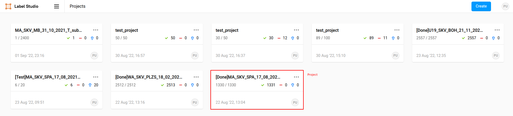
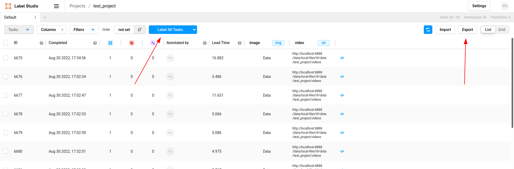
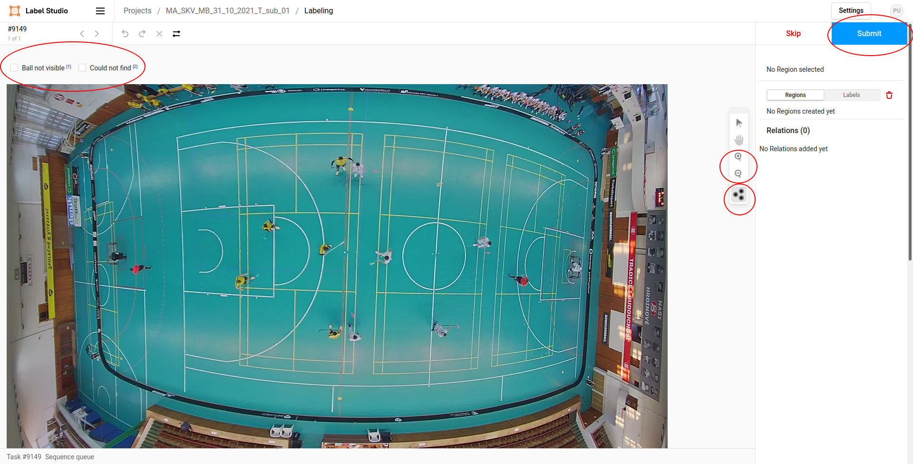
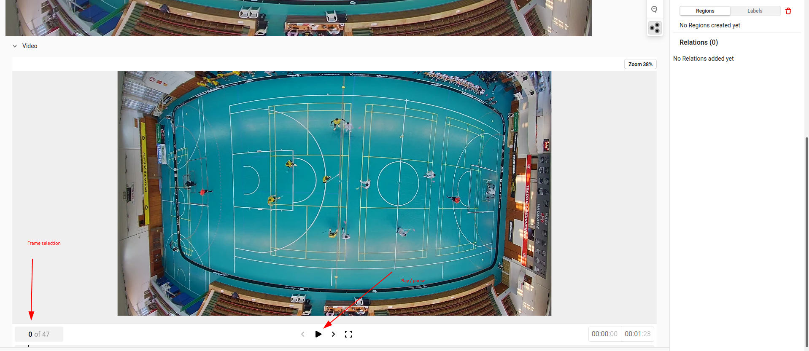

# Annotation HowTo

This is a short How-To regarding the annotation process. It does not relates to the installation or any "development" activities.

In case of any troubles, do not hestitate to contact me - miroslav.purkrabek@fel.cvut.cz

## What and how to annotate

The goal is to localize the ball (or multiple balls) in the image. The ball is tricky to find as sometimes the ball is not in the picture and sometimes the ball is not visible.

Once you find the ball, annotate it by clicking on its center. The small circle will appear in the image. If the circle covers the ball completely, that's it, you can save the frame and continue.

If the ball is not visible, you have two options.

1. The ball is not visible **because it is not there** and you are sure. The example would be ball behind a player. In this case, press '1' and save the annotation with 's'.
2. You can't find the ball and are not sure where it is. In this case, press '2' and save the annotation with 's'.

> **_SUMMARY:_** There are three options how to annotate the image.
> - You can see the ball &#8594; mark in with the mouse ([example](imgs/example_visible.md))
> - You know where the ball is but can't see it &#8594; press '1' ([example](imgs/example_not_visible.md))
> - You don't know where the ball is &#8594; press '2'

## How to run the UI

The main annotation tool is started by the [run.sh](/run.sh) script in the root folder. During installation, you should have created a bashrc alias which should run the tool. Common alias used also for the TOP project is 'annot'.

## How to start annotation with the running UI

### Default view

Below you can see the welcome screen of the annotation UI. Each tile (one of them emphasized in red) represents one *project*. Each project consists of individual frames (usualy around 2000). To start annotating one of the projects, simply click on it.

### Project overview

Next is the project overview. You can see individual frames (rows of the table) with different inforamtions about them. The two main buttons are again emphasized in red in the image below.

**Label all tasks** will open the first unlabelled task in the annotation view. Use this button as it will make the image larger and easier to use.

**Export** generates sharable csv file once the project is done. For more instructions see chapter below.

### Annotation view

Now we see the main annotation view. The goal is to find a ball in the top image. Once you find it, simply click on it and press 's' to save the work. Above the picture, there are two tickboxes for cases when the ball is not visible. See comments above.

It is possible that *keypoints* tool is not selected to and clicking does nothing. In this case, press 'k' and continue as usual.

Since finding the ball can be challenging in some frames, below is a video showing 1 second before and 1 second after the frme. Moving ball is easier to detect than static frame so the video can be useful.

Lastly, you can (and should) zoom the image with the mouse - hold the 'ctrl' button and zoom with the mouse wheel. If you do not have the mouse, there are 'plus' and 'minus' buttons in the top right corner of the image.

.

### Video

The last image shows controls of the video. The numbers showed in bottom left signifies frame of the video. The annotated frame is frame number 23.

## Exporting the project

Once the whole project (approx. 2000 images) is done, export it in the project overview. Please, use the **JSON-MIN** format as shown in the image below.

After exporting the project, save the csv file to your computer and send it to me (probably via email).

.
