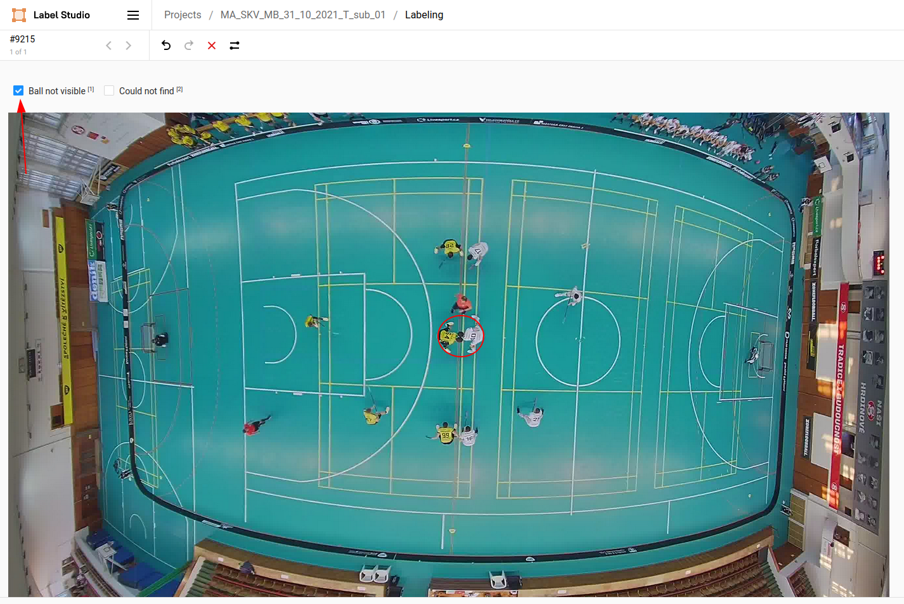

# Example of not visible (but present) ball

The ball is in the center of the red circle (we know it from the video) but is not visible due to occlusion. Mark the image as 'Ball not visible' by pressing '1' (or with mouse as show in the image) and continue by saving with 's' button.

