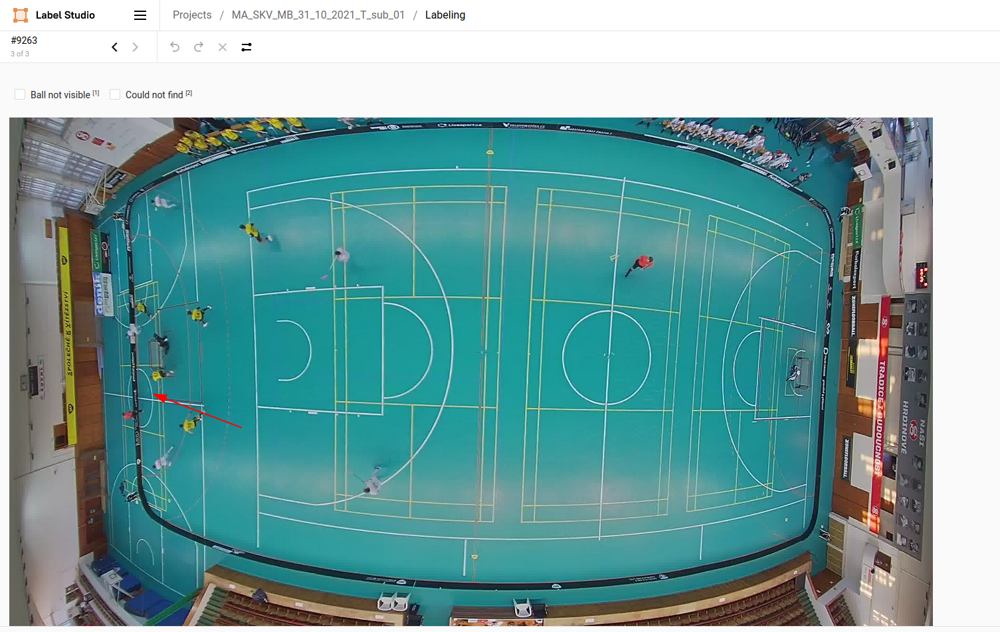
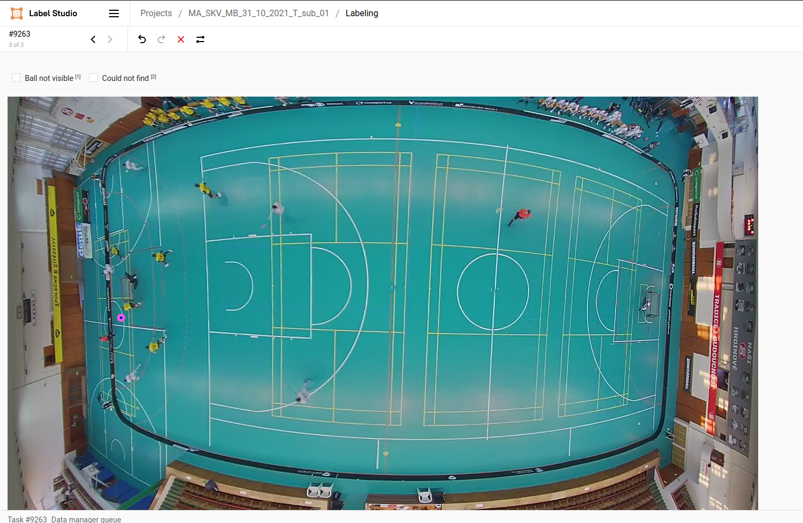

# Example of the visible ball (the most common case)

The ball is blurred but we know from the video that it is where the red arrow points. Zoom the image for precision and mark the position with the mouse click.

After the successful annotation, the image will look like this (see the new blue-purple point where the ball is). Continue to the next image by pressing 's'.

