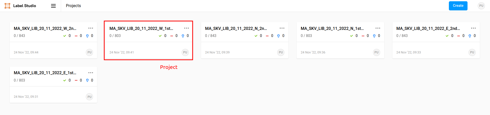
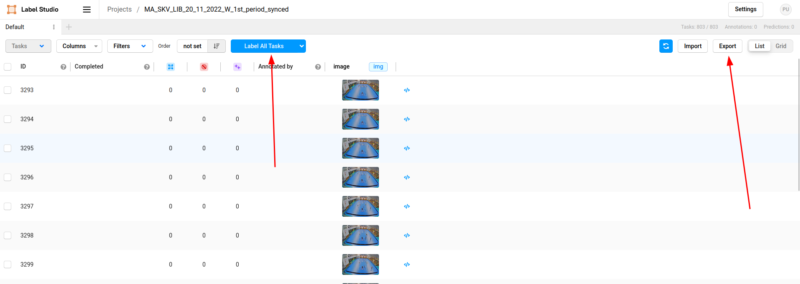
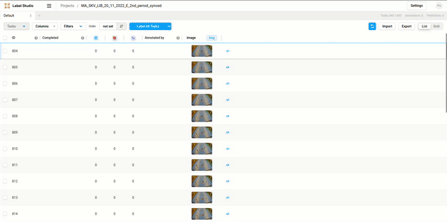
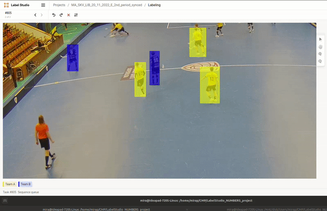
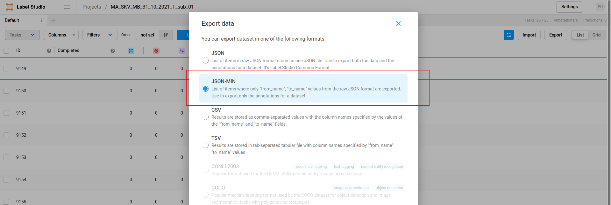

# Annotation HowTo

This is a short How-To regarding the annotation process. It does not relates to the installation or any "development" activities.

In case of any troubles, do not hestitate to contact me - miroslav.purkrabek@fel.cvut.cz

## What and how to annotate

The goal is to mark players with known identity. The identity is given by the jersey number and/or from given context. Players with unknown identity are to be ignored.

Each player has a jersey with big number in back and smaller one in front. There also should be a small number on the shorts but it is usually not visible. The image below shows where to look for numbers. In red circles are numbers for this particualar player, red arrows show where numbers also could be.

If you see a player and you know his number, mark it by a 'bounding box' - rectangle encompassing the player. The recatngle should contain the whole player (all its body parts) and should not be bigger than that. There are two different colors of rectangles: yellow for yellow players and blue for the other team. Therefore, we can distinguish two players with the same number but from a different team.

You can annotate the player even if the number is not visible but **you are sure** of its identity from the context. Example would be the goalie.

> **_SUMMARY:_** When you know jersey number of a player, draw a rectangle around it. Each team has a different color of a rectangle.

## How to run the UI

The main annotation tool is started by the [run.sh](/run.sh) script in the root folder. During installation, you should have created a bashrc alias which should run the tool. Common alias used also for the TOP and BALL projects is 'annot'.

## How to start annotation with the running UI

### Default view

Below you can see the welcome screen of the annotation UI. Each tile (one of them emphasized in red) represents one *project*. Each project consists of individual frames (usualy around 800). To start annotating one of the projects, simply click on it.

### Project overview

Next is the project overview. You can see individual frames (rows of the table) with different inforamtions about them. The two main buttons are again emphasized in red in the image below.

**Label all tasks** will open the first unlabelled task in the annotation view. Use this button as it will make the image larger and easier to use.

**Export** generates sharable csv file once the project is done. For more instructions see chapter below.

### Annotation view

Now we see the main annotation view. The goal is to find all players with visible jersey number, draw rectangle (bounding box) around them and write down their number. 

At first, you will see the image and two teams (colors) in bottom left corner (see the red arrow in the image below). When no other tool is selected and one of the teams is (the blue is selected in the image), you will draw a rectangle with the mouse (click and hold and draw the rectangle).

Once you draw the rectangle, you can see a field for jersey number below the image. See the video below as an example.

Each recatngle has its own number. If you want to chage the jersey number, simply click on the rectangle and rewrite the number (see video below). You can also check if all rectangles have right number. The app won't let you save the work unless all rectangles have their number.

You can switch between different tools either with mouse of by the keyboard. With the 'hand' sign in top right, you can move the image with your mouse. When drawing recatngles, you can switch their color with keys '1' and '2'. See the example use below. 

Lastly, you can (and should) zoom the image with the mouse - hold the 'ctrl' button and zoom with the mouse wheel. If you do not have the mouse, there are 'plus' and 'minus' buttons in the top right corner of the image.

Here in the bottom right corner you can see which keys I'm pressing. In short, it's:

- *ctrl + mouse wheel* - zoom the image
- *h* - move the image
- *1* and '2' - switch rectangle color (teams)
- *esc* - quit any tool you are using now

### Examples of annotations

More examples of annotations are in [this link](bbox_examples.md).

## Exporting the project

Once the whole project (approx. 800 images) is done, export it in the project overview. Please, use the **JSON-MIN** format as shown in the image below.

After exporting the project, save the csv file to your computer and send it to me (probably via email).

.
