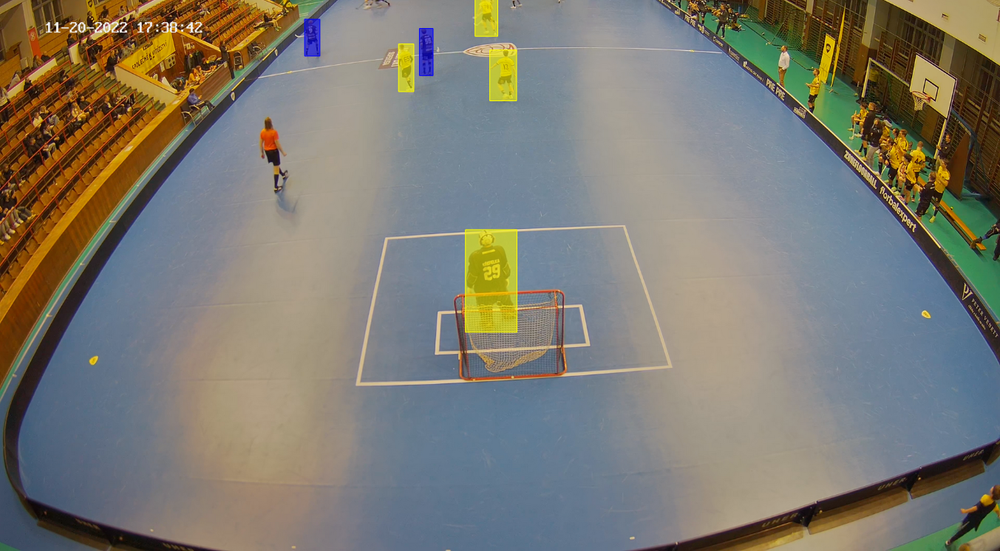
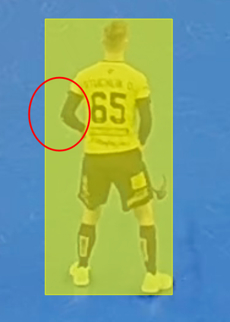

# Annotation examples

Here I present some examples of correct and wrong annotation. Each image has its description. You can click images to their full size.

## Which player annotate

These images show which players are to be anotated. Select only those players with known identity and give players the proper color. Goalie is t be annotated the same color as its team. Examples are shown in pictures below.

  
  

And one more in the zommed situation.

  
  

## How to draw a rectangle

The rectangle should be close fit for the player. The edges should touch its body parts. In other word, the rectangle should be as small as possible while having the whole player inside.

The player is only the body, not the stick. The **correct example** is shown below.

### Wrong rectangles

Now I show common errors while drawing rectangles. The errors are:

- a) The head is not in the rectangle - rectangle too small.
- b) The feet is not in the rectangle - rectangle too small.
- c) The rectangle is too big.

  
  
  

