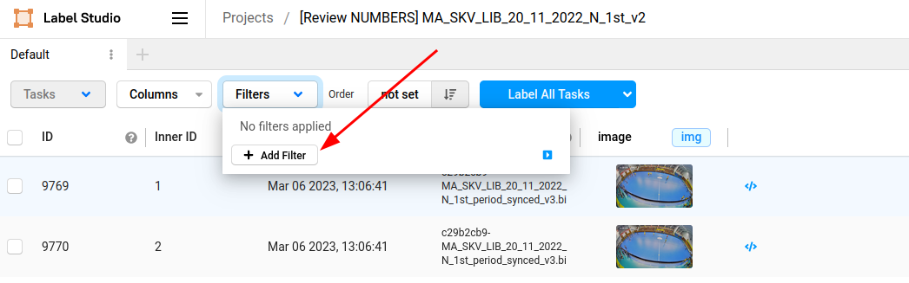
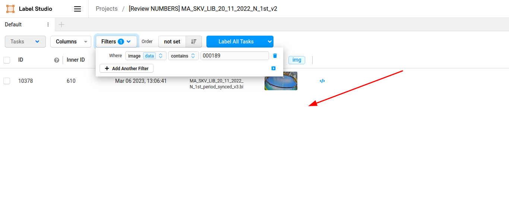

# How to find specific files by their name

Below I explain how to find the specific file in the project. I focus on filtering files by their name (source image name). All steps are illustrated in the images below.

### Set up a new filter
1. In the project view, select filters. 
2. Add a new filter
3. Configure the filter - to search for a specific image, select 
    - where: image (data)
    - contains
    - image name (the image name is always six characters long and padded with zeros, so 4 is 000004, 258 is 000258 and so on)
4. The filter will be applied in real-time. If you did everything OK, you would see only one image in the project view
5. Click anywhere else to continue working on the project. The filter will stay active.

### Delete active filter (go back to 'view all' mode)
After you finish working with the one file, you need to deactivate the filter to see all images.
1. In the project view, select filters
2. Remove all filters with the 'trash bin' icon

## Images

