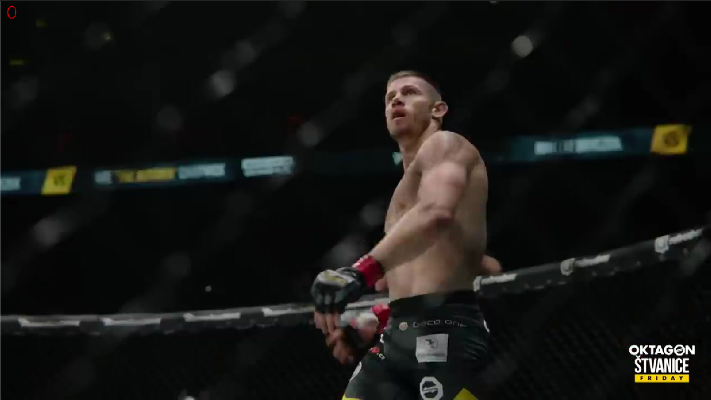
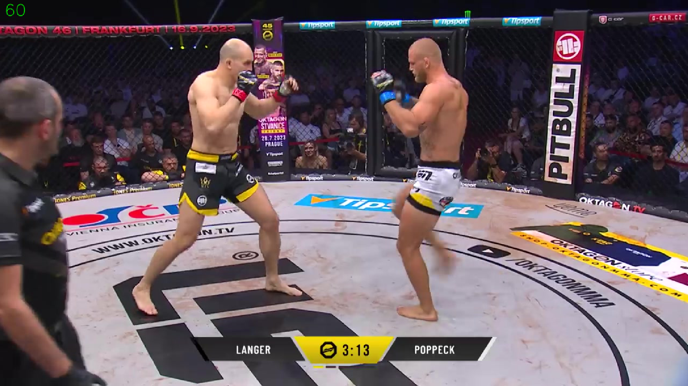
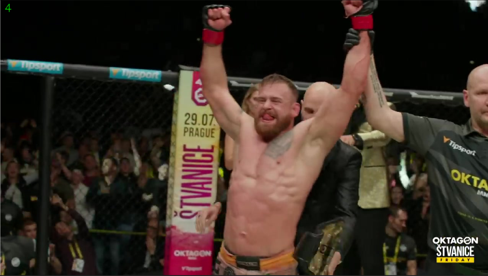
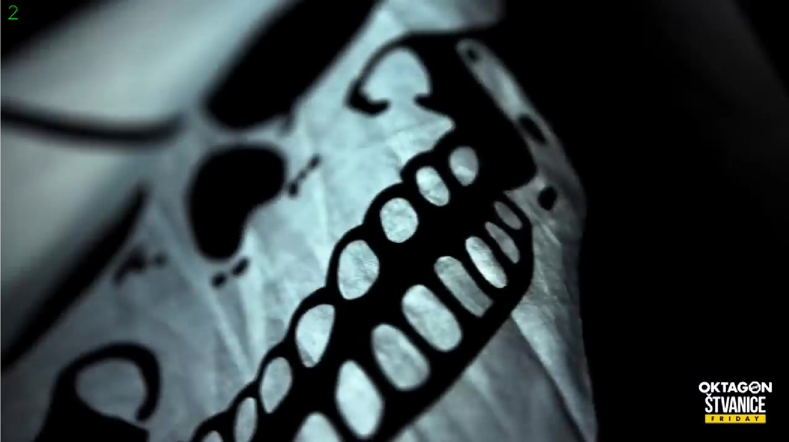
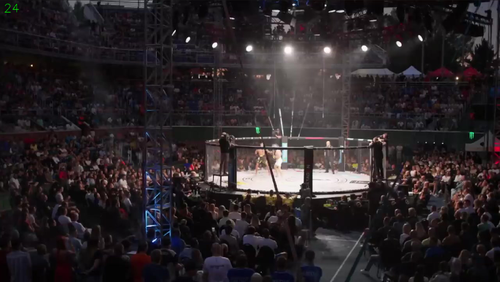

# Example images with annotations

Here are published the example images which should not be annotated in the MMA task.

## Bounding boxes

People in the ring are well separated (no occlusion or close proximity)

  
  

Scenes that are not during the fight (celebrations etc.) and scenes with ads.

  
  

Scenes that are too far away.

  

For examples when to annotate, see [positive samples](MMA_positive.md).