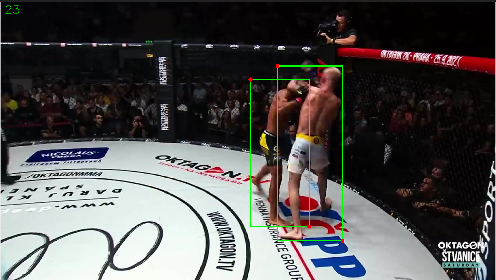
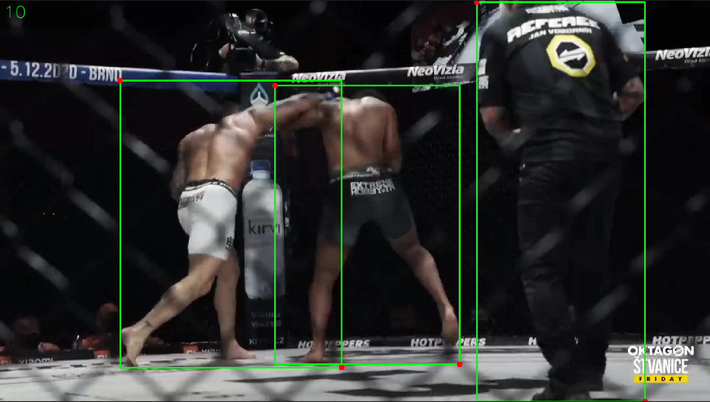
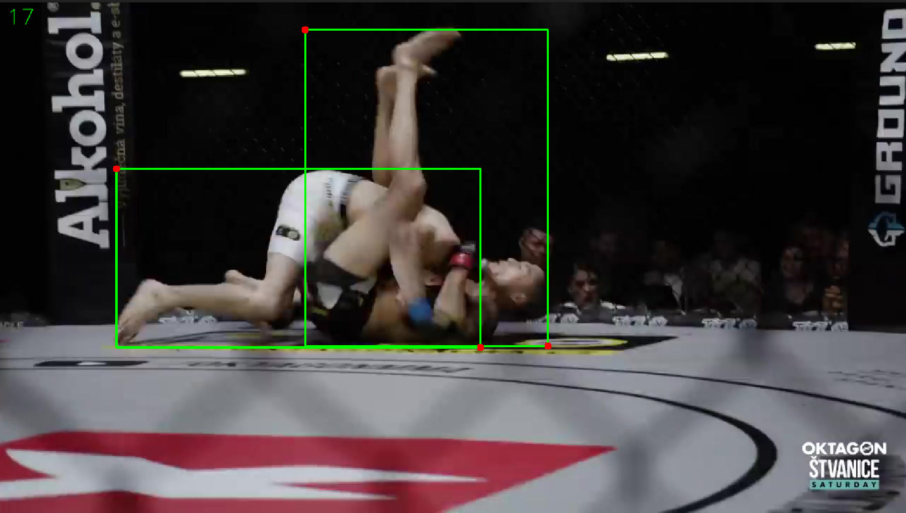
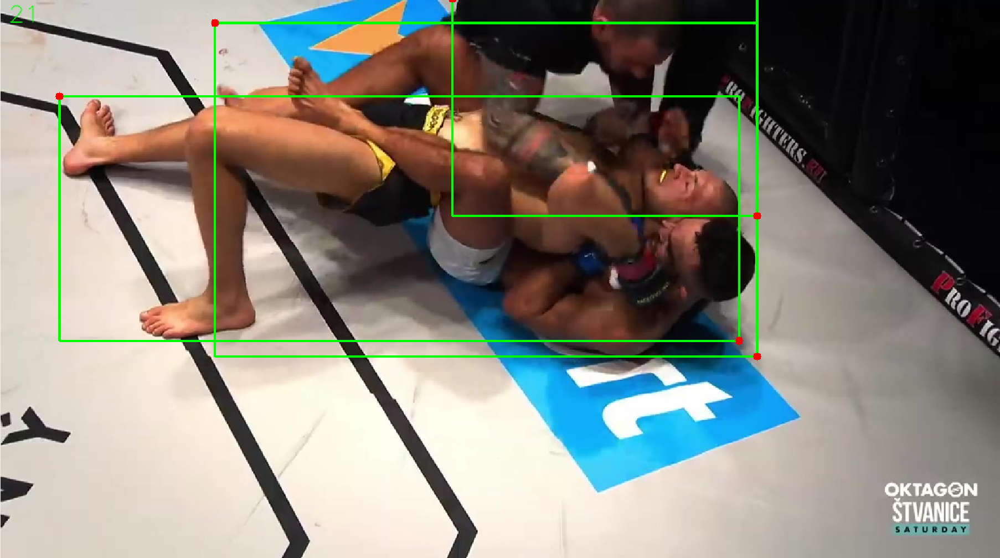
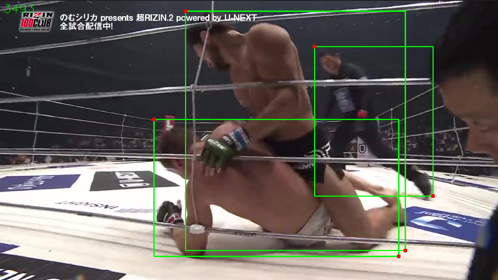
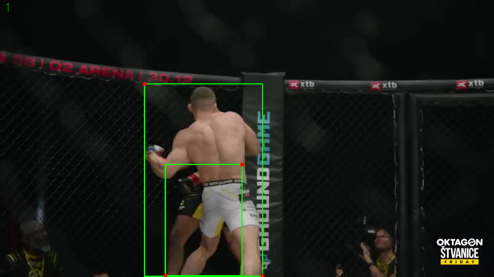
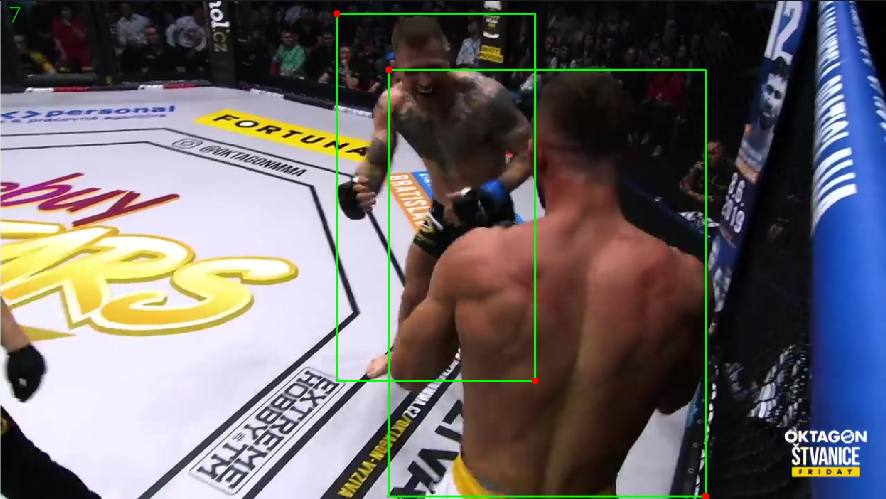
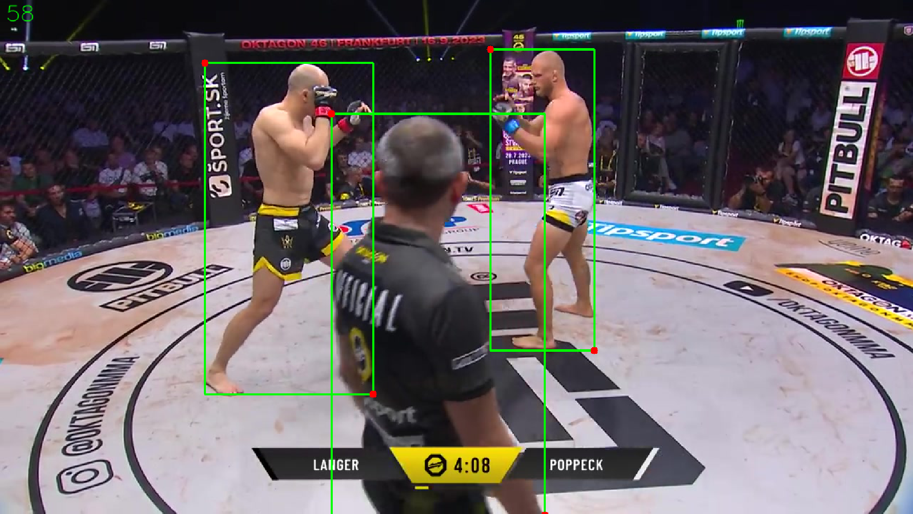
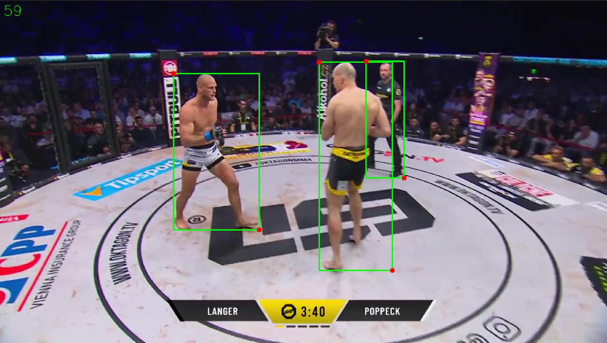

# Example images with annotations

Here are published the example images of correct annotations of MMA matches.

## Bounding boxes

Two fighters close to each other. If the refree is visible, annotate him too.

  
  
  
  

Annotate even when the image is taken through the fence of the ring.

  

Annotate even when people are not close to each in reality other but they overlap in the picture (including the referee.)

  
  
  
  

For examples when nothing should be annotated (keep picture blank), see [negative samples](MMA_negative.md).