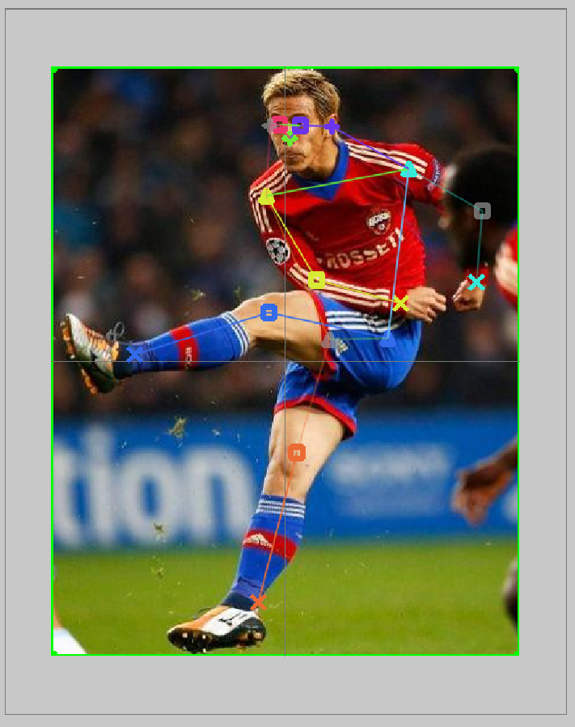

# Out-of-image annotation

The goal of this task is to annotate 17 keypoints for each bounding box. We want to get as much information as possible about the keypoint. Therefore, we want the annotation even for points which are out-of-image.

The annotation details are described below. The annotation process involves a lot of estimation and guessing and we expect the points with high occlusion or out-of-image to have much lower precision than directly visible points. It is crucial to mark keypoints visibility correctly to indicate the level of confidence.

## Keypoint visibility

| Value | Appeareance                           | Definition                                     | Example                                                                         |
| ----- | ------------------------------------- | ---------------------------------------------- | ------------------------------------------------------------------------------- |
| 0     | No keypoint, no bones                 | No information, keypoint can be anywhere       |                                                                                 |
| 1     | Grey keypoint with semi-visible bones | Location of keypoint precise but not visible   | [Example](images/visibility_1.png)                                              |
| 2     | Fully visible keypoint and bones      | Keypoint is clearly visible                    | [Example](images/visibility_2.png)                                              |
| 3     | No keypoint, semi-visible bones       | Location of keypoint approaximate, not visible | [Example 1](images/visibility_3.png) and [Example 2](images/visibility_3_1.png) |

## Keypoint localization 

If the keypoint is not in the image, we estimate it's location in the grety strip around the image. The scale of the gray area is **exponential** so that the first line (in the middle of the script) corresponds to distance of half of the image, second line distance of the image and so on.

| Line | Scaled distance from the border of the image | Real distance from the border of the image |
| ---- | -------------------------------------------- | ------------------------------------------ |
| 1    | 1/2 of the image width/height                | 1/2 of the strip width/height              |
| 2    | 2/2 of the image width/height                | 3/4 of the strip width/height              |
| 3    | 3/2 of the image width/height                | 7/8 of the strip width/height              |

To better visualize the distance transform, see image below. Here points with the same color have the same distance from the bold black line (top border of the image).

## Examples

### Correct example

Here you can see example of correct annotation. For visualization, all keypoints are annotated as visible but the correct way is to label keypoints outside image with visibility 3 (no keypoint).

The left part of the body is visible, so we annotate it directly in the image.

The rest of the body is out-of-image, so we estimate it.
- The right shoulder would be approximately image_width/2 far from the image border so it is on the first grey line
- The face keypoints are somewhere above and between shoulders. Due to distance transform, they will be all almost in the same place.
- The right arm is probably stretched in the same way as the left one. The wrist is image_width far from the image border, so it is around the second grey line. Elbow is between shoulder and wrist.
- The right leg is symmetrical with the left one. Again, due to the distance transform, it will look straighter.

The next images are also correct apart from keypoints visibility outside of the image for visualization purposes.

### Common errors

Missing annotation af ankles. Try to estimate it.

